# 🔄 Ansible Dynamic Assignments(include) and Community Roles

<details>
<summary><h2>📘 Table of Contents</h2></summary>

- [🔄 Ansible Dynamic Assignments(include) and Community Roles](#-ansible-dynamic-assignmentsinclude-and-community-roles)
  - [🔄 Ansible Dynamic Assignments (include) vs Static Assignments (import)](#-ansible-dynamic-assignments-include-vs-static-assignments-import)
    - [⚙️ Concept Overview](#️-concept-overview)
  - [🧩 Static Assignments — “Preprocessed” Logic](#-static-assignments--preprocessed-logic)
    - [Advantages](#advantages)
    - [Disadvantages](#disadvantages)
  - [⚡ Dynamic Assignments — “Evaluated at Runtime”](#-dynamic-assignments--evaluated-at-runtime)
    - [Advantages](#advantages-1)
    - [Disadvantages](#disadvantages-1)
  - [🧠 When to Use Each](#-when-to-use-each)
  - [🧭 Best Practice Recommendation](#-best-practice-recommendation)
  - [✅ Summary](#-summary)
- [🌀 Introducing Dynamic Assignment into Our Structure](#-introducing-dynamic-assignment-into-our-structure)
    - [Step 1: Create a New Branch](#step-1-create-a-new-branch)
    - [Step 2: Create Dynamic Assignment Files](#step-2-create-dynamic-assignment-files)
    - [Step 3: Define the env-vars.yml Logic](#step-3-define-the-env-varsyml-logic)
    - [🔍 3 Key Things to Note](#-3-key-things-to-note)
  - [⚙️ Updating site.yml with Dynamic Assignments](#️-updating-siteyml-with-dynamic-assignments)
    - [🧩 Explanation of Each Section](#-explanation-of-each-section)
    - [✅ Summary](#-summary-1)
- [🌍 COMMUNITY ROLES IN ANSIBLE](#-community-roles-in-ansible)
  - [💾 DOWNLOAD AND CONFIGURE MYSQL COMMUNITY ROLE](#-download-and-configure-mysql-community-role)
    - [✅ Steps Implemented](#-steps-implemented)
  - [⚖️ CONFIGURING LOAD BALANCER ROLES FOR NGINX \& Apache (Dynamic Selection)](#️-configuring-load-balancer-roles-for-nginx--apache-dynamic-selection)
    - [🧩 Overview](#-overview)
    - [🚀 Run \& Test](#-run--test)
  - [🧱 Troubleshooting Tips](#-troubleshooting-tips)
  - [🏁 Commit \& Push to GitHub](#-commit--push-to-github)
  - [✅ Summary](#-summary-2)

</details>


In this phase of the project, we introduced dynamic assignments in Ansible using the include family of modules.

## 🔄 Ansible Dynamic Assignments (include) vs Static Assignments (import)

Understanding the difference between static and dynamic assignments is key to designing flexible and maintainable playbooks.

### ⚙️ Concept Overview

Ansible provides two major ways to reuse and organize your automation code:

| Type                   | Module Used                                                         | Evaluation Time                                  | Behavior                                                                                                  | Typical Use Case                                                                              |
| ---------------------- | ------------------------------------------------------------------- | ------------------------------------------------ | --------------------------------------------------------------------------------------------------------- | --------------------------------------------------------------------------------------------- |
| **Static Assignment**  | `import_*` (e.g., `import_playbook`, `import_tasks`, `import_role`) | **Parse-time** – when the playbook is first read | Ansible loads all referenced files *before* execution begins. Any changes made after parsing are ignored. | Core structure and reusable logic that rarely changes.                                        |
| **Dynamic Assignment** | `include_*` (e.g., `include_tasks`, `include_vars`, `include_role`) | **Run-time** – during playbook execution         | Files and variables are processed *only when* the playbook reaches the include statement.                 | Environment-specific variables, conditional roles, or tasks that depend on runtime decisions. |

> In short:
> 
> - import = static (predictable)
> 
> - include = dynamic (flexible)

## 🧩 Static Assignments — “Preprocessed” Logic

When you use import, Ansible reads and expands all referenced content before the first task runs.
That means imported tasks, roles, or playbooks are fully baked into the playbook at parse time.

Example:
```yml
# site.yml
---
- import_playbook: static-assignments/common.yml
- import_playbook: static-assignments/webservers.yml
```
If you edit common.yml after the playbook starts, Ansible will not see the changes — it already parsed the file.

### Advantages
- Predictable and easier to debug.
- Validates all referenced playbooks and tasks before execution.
- Fails early if there’s a syntax or path issue.

### Disadvantages
- Not flexible for runtime logic (e.g., choosing which environment or role dynamically).

## ⚡ Dynamic Assignments — “Evaluated at Runtime”

When you use include, Ansible processes the included file only when that line is reached during execution.
This means you can load different files or roles based on environment, conditions, or discovered facts.

Example:
```yml
# dynamic-assignments/env-vars.yml
---
- name: Load environment-specific variables
  hosts: all
  tasks:
    - name: Include vars dynamically based on environment
      include_vars: "{{ item }}"
      with_first_found:
        - files:
            - dev.yml
            - stage.yml
            - prod.yml
            - uat.yml
          paths:
            - "{{ playbook_dir }}/../env-vars"
      tags: always
```

In this example:
- Ansible loops through the list of possible environment files.
- The first one found (e.g., uat.yml) is loaded dynamically.
- If a file doesn’t exist, Ansible moves to the next providing graceful fallback behavior.

### Advantages
- Highly flexible — reacts to runtime conditions.
- Perfect for environment-specific variables and dynamic infrastructure.
- Supports loops and when conditions.

### Disadvantages
- Harder to debug because logic unfolds at runtime.
- Validation is deferred — syntax errors in included files appear only when the include is reached.
- Slightly slower since parsing happens repeatedly at execution time.

## 🧠 When to Use Each
| Scenario                                                                       | Recommended Approach    |
| ------------------------------------------------------------------------------ | ----------------------- |
| Common, stable logic (e.g., base configurations, users, security hardening)    | **Static (`import`)**   |
| Conditional or environment-dependent content (e.g., prod vs dev vars, LB type) | **Dynamic (`include`)** |
| Debugging or step-by-step testing                                              | **Static (`import`)**   |
| Runtime flexibility, e.g., selecting roles or vars based on conditions         | **Dynamic (`include`)** |

## 🧭 Best Practice Recommendation

While static assignments are more reliable and easier to debug, dynamic assignments shine when you need flexible configurations across multiple environments.

In this project:
- Static imports (import_playbook) are used for stable, reusable components.
- Dynamic includes (include_vars) are introduced specifically for environment-specific variables such as:
  - Server names
  - IP addresses
  - Load balancer selection (nginx vs apache)
  - Database credentials per environment

This combination ensures a clean, modular, and environment-aware automation structure.

> ### ⚠️ Important Note
> 
> 
> 
> From Ansible 2.8 onward, the legacy include module has been deprecated and split into specialized modules:
> 
> - include_vars — for variable files
> 
> - include_tasks — for task lists
> 
> - include_role — for roles
> 
> 
> 
> Similarly, import has specialized variants:
> 
> 
> 
> - import_playbook, import_tasks, import_role
> 
> 
> 
> Using these dedicated modules improves readability, clarity, and future-proofs your automation.

## ✅ Summary
| Key Takeaway             | Explanation                                                                            |
| ------------------------ | -------------------------------------------------------------------------------------- |
| **Static = predictable** | Use `import` for structure and predictable behavior.                                   |
| **Dynamic = flexible**   | Use `include` for runtime variability and environment-driven logic.                    |
| **Combine both**         | Most real-world Ansible projects mix both for optimal flexibility and maintainability. |

---

# 🌀 Introducing Dynamic Assignment into Our Structure

To make our configuration even more flexible and environment-aware, we introduced dynamic assignments into the Ansible structure.

### Step 1: Create a New Branch

In your GitHub repository, create a new branch called `dynamic-assignments`.
This allows you to test new configurations safely without affecting the main branch.
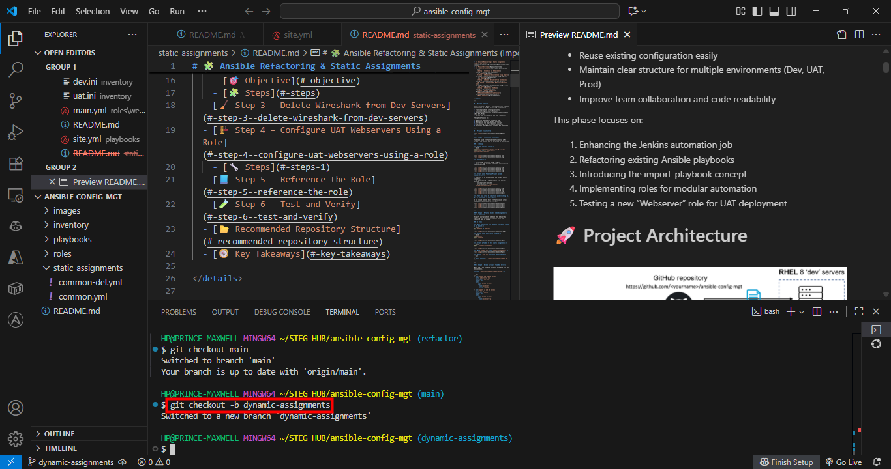

### Step 2: Create Dynamic Assignment Files

Inside the project directory, create a new folder named `dynamic-assignments`.
Within it, create a new file named `env-vars.yml` — this playbook will later be included in `site.yml`.
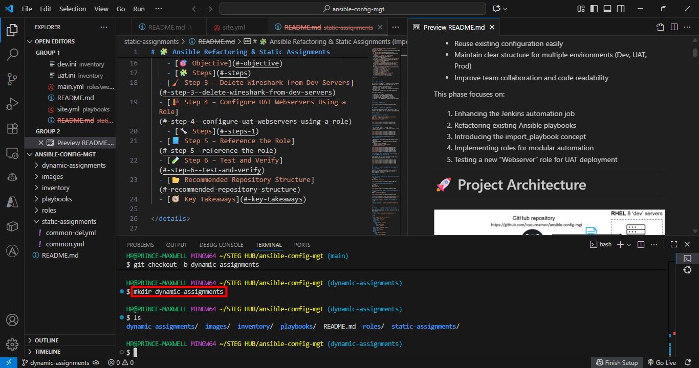
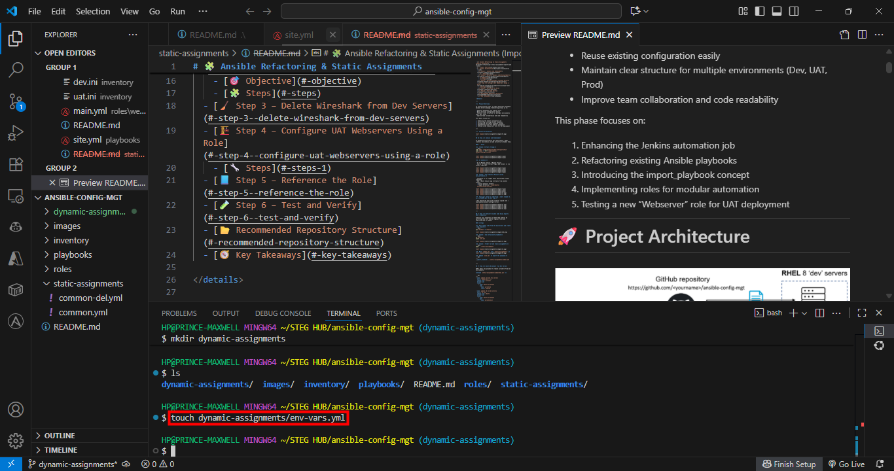

Since each environment (e.g., dev, stage, prod, uat) has its unique parameters such as server names and IP addresses, we’ll maintain environment-specific variable files.

To organize them:

1. Create a folder called env-vars.

2. Inside it, create YAML files for each environment:
   - `dev.yml`
   - `stage.yml`
   - `prod.yml`
   - `uat.yml`

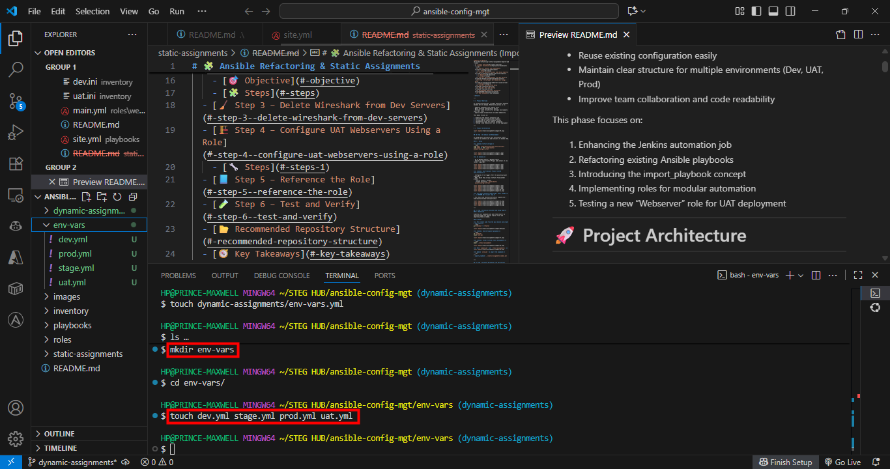

### Step 3: Define the env-vars.yml Logic

Add the following content into `env-vars.yml`:
```yml
---
- name: Collate variables from env specific file, if it exists
  hosts: all
  tasks:
    - name: Looping through list of available files
      include_vars: "{{ item }}"
      with_first_found:
        - files:
            - dev.yml
            - stage.yml
            - prod.yml
            - uat.yml
          paths:
            - "{{ playbook_dir }}/../env-vars"
      tags:
        - always
```
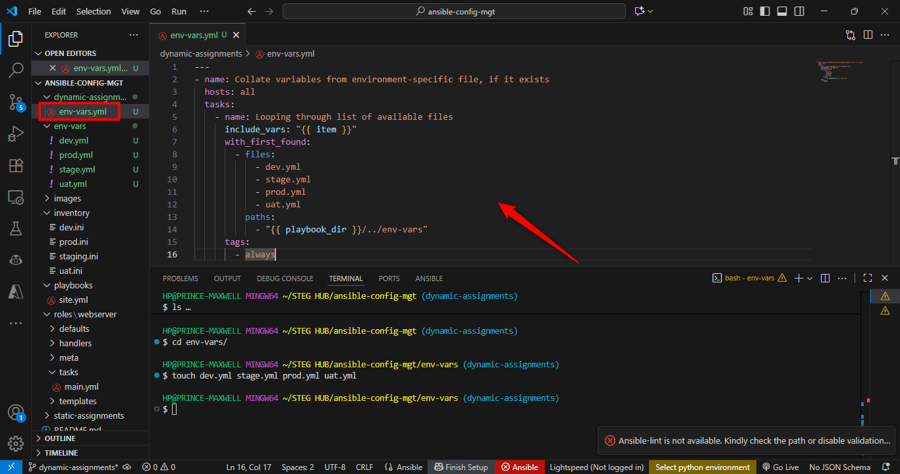

### 🔍 3 Key Things to Note

**1. Use of include_vars instead of include**
- From Ansible version 2.8, the include module was deprecated.
- Variants like include_vars, include_tasks, and include_roles were introduced for clarity.

- Similarly, import variants (import_role, import_tasks) were also added.

**2. Dynamic Path Resolution**
- {{ playbook_dir }} automatically detects the current playbook’s location, enabling Ansible to locate related files dynamically.
- {{ inventory_file }} resolves to the active inventory file, allowing you to append .yml dynamically to pick the right environment variable file.

**3. Looping with with_first_found**
- This ensures Ansible picks the first available file in the specified order.
- It’s useful for setting default fallback values in case an environment-specific variable file doesn’t exist.

## ⚙️ Updating site.yml with Dynamic Assignments

Next, we’ll update the main `site.yml` file to include the new dynamic assignment logic. This ensures that environment-specific variables are automatically loaded whenever we run our playbook.

**Modify `site.yml`**

Open your existing site.yml file and update it as shown below:
```yml
---
- name: Include dynamic environment variables
  hosts: all
  tasks:
    - include vars: ../dynamic-assignments/env-vars.yml
      tags:
        - always

# Import common configuration for all servers
- import_playbook: ../static-assignments/common.yml

# Import UAT webserver configurations
- import_playbook: ../static-assignments/uat-webservers.yml
```
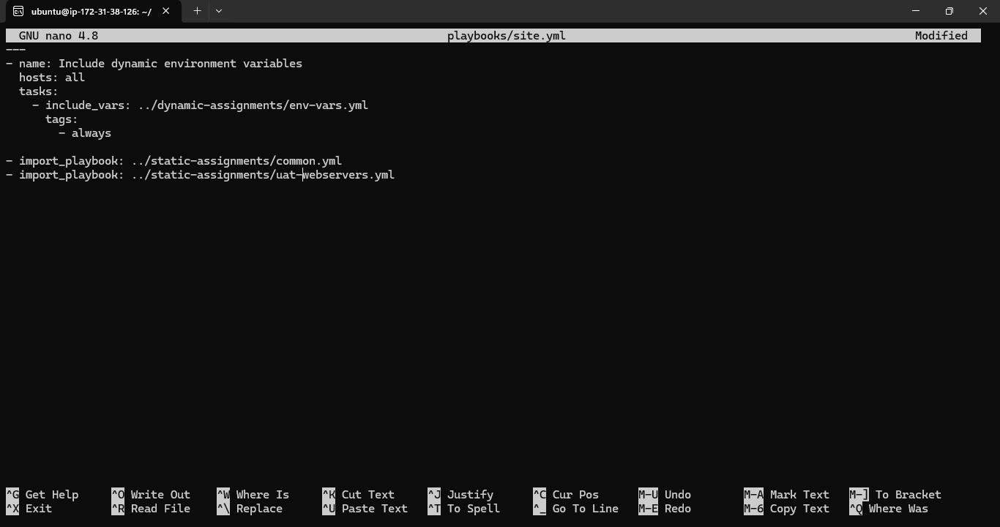

### 🧩 Explanation of Each Section

**1️⃣ Dynamic Environment Variables**

This section dynamically loads environment-specific variables from the `dynamic-assignments/env-vars.yml` file.
These variables determine which environment is being configured (for example, `dev`, `uat`, or `prod`) and set parameters such as whether a load balancer is required or which webserver should be deployed.
- `include_vars` executes at runtime, meaning any updates to the variable files are immediately applied without re-parsing the playbook.
- The `always` tag ensures this task runs every time, regardless of which tags are specified during playbook execution.

**2️⃣ Common Configuration**

This statically imports the `common.yml` playbook containing baseline configurations shared across all servers — such as:
- Installing essential packages
- Setting up users and permissions
- Applying general security and system hardening policies

Because it uses `import_playbook`, the referenced playbook is parsed before execution, ensuring reliability and consistency across environments.

**3️⃣ UAT Webserver Configuration**

This section imports configurations specific to the UAT (User Acceptance Testing) webservers.
It can include tasks such as:
- Installing and configuring Nginx or Apache
- Deploying application code
- Starting or reloading the web services

Using `import_playbook` here ensures predictable execution and easy debugging, as all referenced playbooks are validated upfront.

### ✅ Summary

By combining dynamic and static assignments in one playbook:
- Dynamic (include_vars) → Loads environment-specific variables at runtime.
-  Static (import_playbook) → Imports reusable playbooks at parse time for consistent structure.

This approach keeps your automation:
- Modular — each environment’s configuration is isolated but linked.
- Scalable — supports multiple environments with a single site.yml.
- Maintainable — common and environment-specific logic remain neatly separated.

---

# 🌍 COMMUNITY ROLES IN ANSIBLE
🧩 What Are Community Roles?

Community roles are reusable, pre-built Ansible roles shared by developers and DevOps engineers on Ansible Galaxy.

They help automate common tasks — like installing and configuring databases, web servers, or monitoring tools — without having to write every task from scratch.

Each role typically includes:
- Tasks (tasks/main.yml)
- Variables (defaults/main.yml or vars/main.yml)
- Templates (for config files)
- Handlers (for service restarts)
- Metadata (author, dependencies, supported OS, etc.)

Using community roles saves time, promotes consistency, and ensures you’re following best practices widely used in production systems.

## 💾 DOWNLOAD AND CONFIGURE MYSQL COMMUNITY ROLE

In this project, we used a community role for MySQL created by Jeff Geerling
, a well-known Ansible contributor.

This role installs and configures MySQL automatically — handling package installation, database creation, user setup, and permissions.

### ✅ Steps Implemented

**1. Create a new feature branch for roles**
```bash
git checkout -b roles-feature
```

**2. Install the community role**

From your `ansible-config-mgt/roles` directory:
```bash
ansible-galaxy install geerlingguy.mysql
```
This downloads the role into the `roles/` directory.
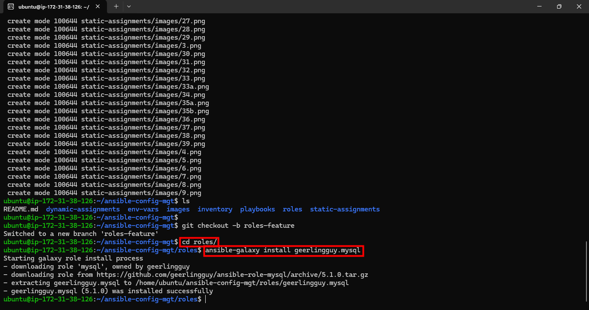

**3. Rename for clarity**
```bash
mv geerlingguy.mysql/ MySQL
```
> Renaming keeps your role structure clean and consistent with other roles (e.g., `nginx`, `apache`).
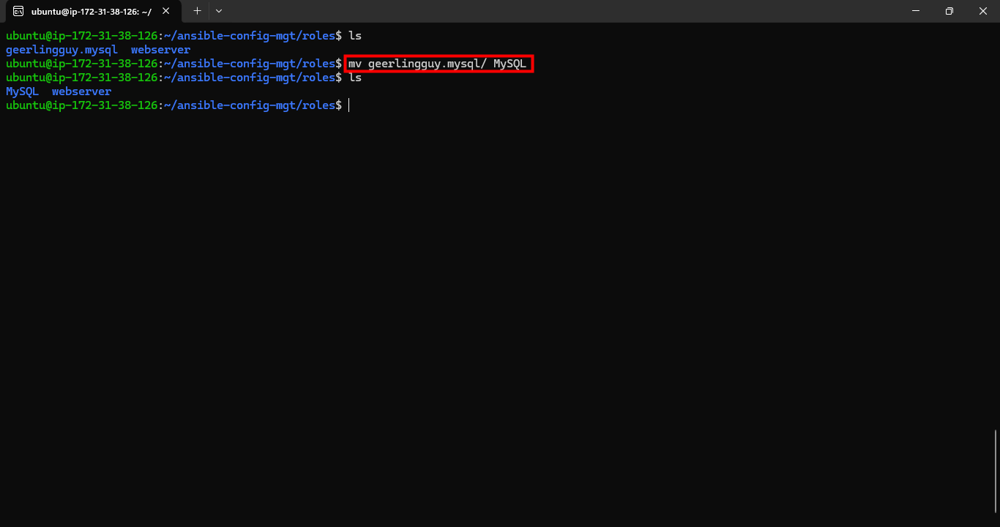

**4. Customize Role Variables**

Open the `roles/MySQL/defaults/main.yml` file and configure MySQL credentials and database settings for your tooling website.

Example:
```sql
mysql_root_password: "StrongRootPass"
mysql_databases:
  - name: tooling
mysql_users:
  - name: tooling_user
    host: "%"
    password: "ToolingPass123"
    priv: "tooling.*:ALL"
```
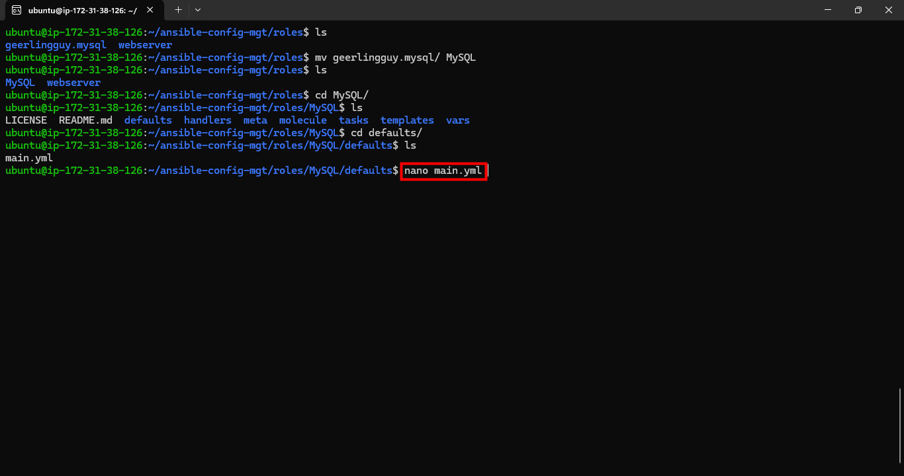
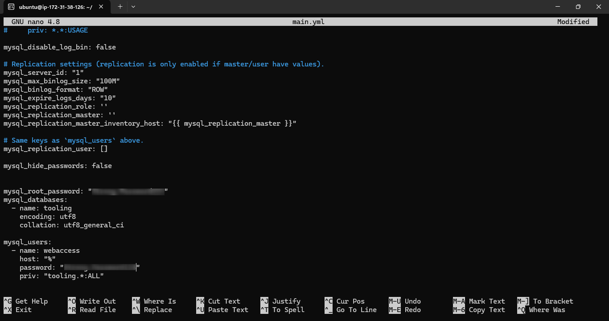

**5. Commit and Push Changes**
```bash
git add .
git commit -m "Add and configure MySQL community role"
git push --set-upstream origin roles-feature
```

**6. Create a Pull Request and Merge**

After verifying your configuration, merge the branch into main on GitHub.

## ⚖️ CONFIGURING LOAD BALANCER ROLES FOR NGINX & Apache (Dynamic Selection)

### 🧩 Overview

In this stage, we implemented dynamic load balancer selection for our environment.
The goal was to make Ansible smart enough to decide whether to:
- Deploy a Load Balancer at all (based on environment variables), and
- Choose NGINX or Apache dynamically — without manually editing playbooks.

This setup makes our playbooks environment-aware, reusable, and highly modular.

**📁 Step 1: Create Roles via Ansible Galaxy**

Inside the ansible-config-mgt directory, create two new roles for your load balancers using Ansible Galaxy:
```bash
cd ~/ansible-config-mgt/roles

# Create nginx role
ansible-galaxy init nginx

# Create apache role
ansible-galaxy init apache
```
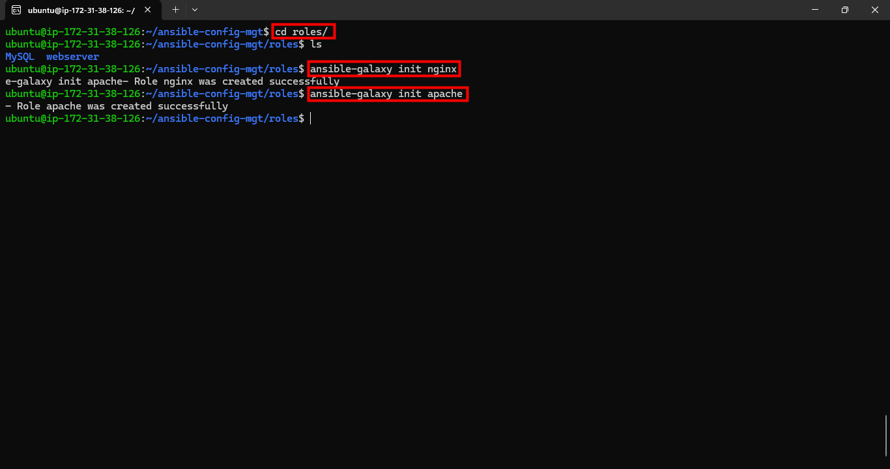

This will generate the following directory structure for each role:
```markdown
roles/
├── nginx/
│   ├── defaults/
│   ├── tasks/
│   ├── handlers/
│   ├── templates/
│   └── ...
└── apache/
    ├── defaults/
    ├── tasks/
    ├── handlers/
    ├── templates/
    └── ...
```

**⚙️ Step 2: Define Default Variables**

We want to control which load balancer is active per environment.
In both roles, create or update the file `defaults/main.yml`.

`roles/nginx/defaults/main.yml`
```yml
---
enable_nginx_lb: false
load_balancer_is_required: false
```
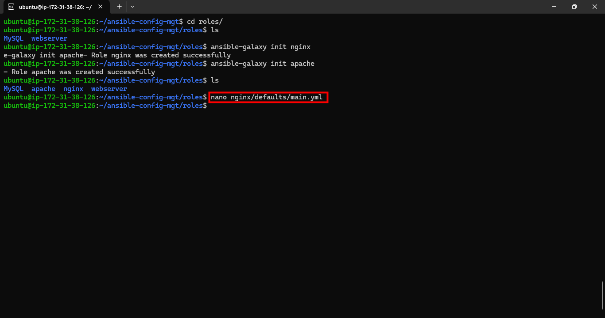
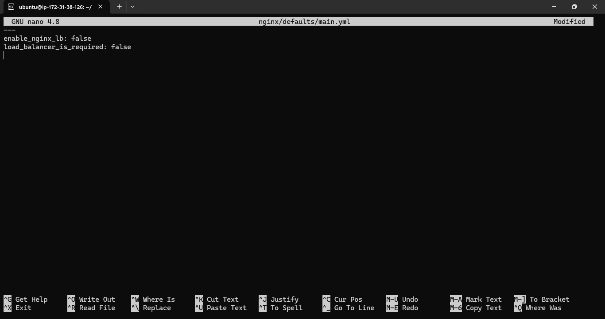

`roles/apache/defaults/main.yml`
```yml
---
enable_apache_lb: false
load_balancer_is_required: false
```
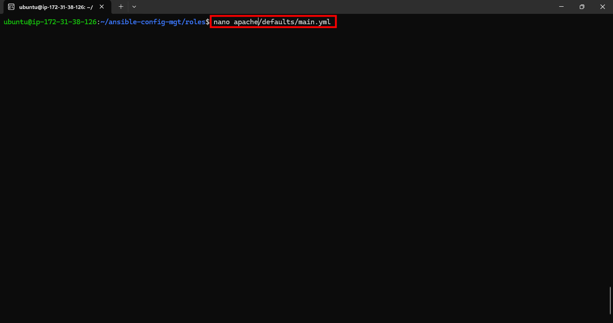


> 🧠 These variables act as feature toggles 
> - Only the chosen role will execute.
> - Both are set to false by default to prevent accidental runs.

**🔧 Step 3: Add Role Tasks**

Define installation and startup tasks for each load balancer.
Each task is guarded by the `when` condition to ensure it only runs when enabled.

`roles/nginx/tasks/main.yml`
```yml
---
- name: Install NGINX Load Balancer
  ansible.builtin.package:
    name: nginx
    state: present
  when: enable_nginx_lb

- name: Start and Enable NGINX Service
  ansible.builtin.service:
    name: nginx
    state: started
    enabled: yes
  when: enable_nginx_lb
```
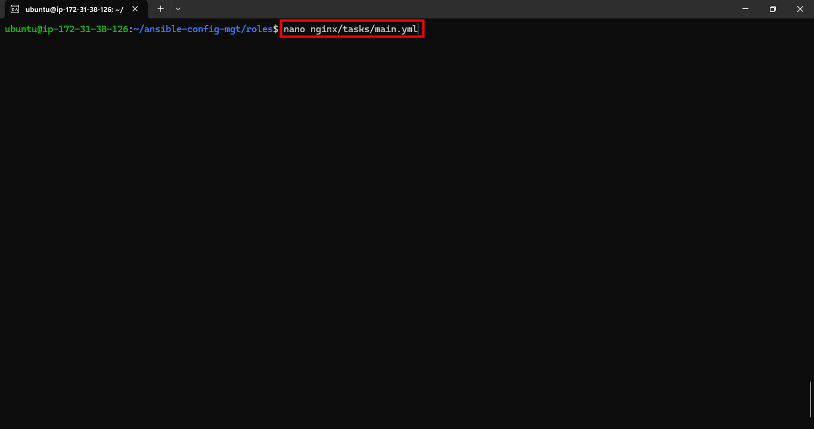
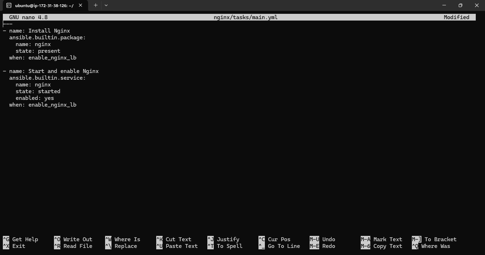

`roles/apache/tasks/main.yml`
```yml
---
- name: Install Apache Load Balancer
  ansible.builtin.package:
    name: "{{ 'apache2' if ansible_os_family == 'Debian' else 'httpd' }}"
    state: present
  when: enable_apache_lb

- name: Start and Enable Apache Service
  ansible.builtin.service:
    name: "{{ 'apache2' if ansible_os_family == 'Debian' else 'httpd' }}"
    state: started
    enabled: yes
  when: enable_apache_lb
```
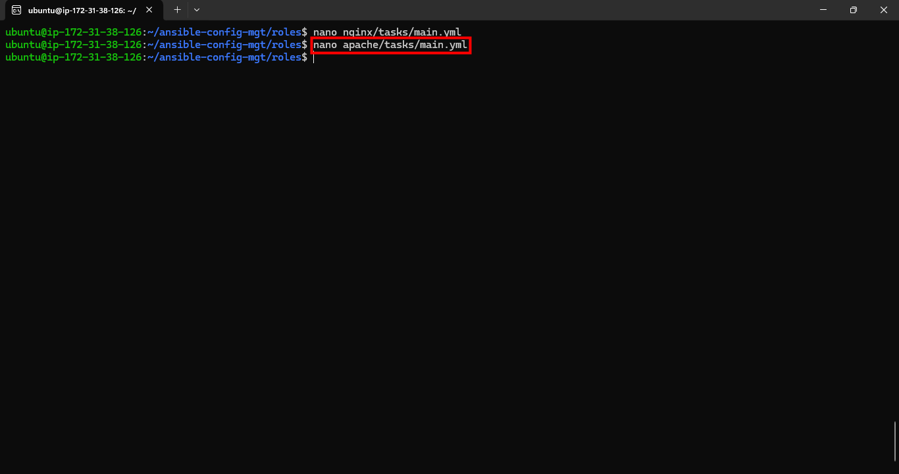
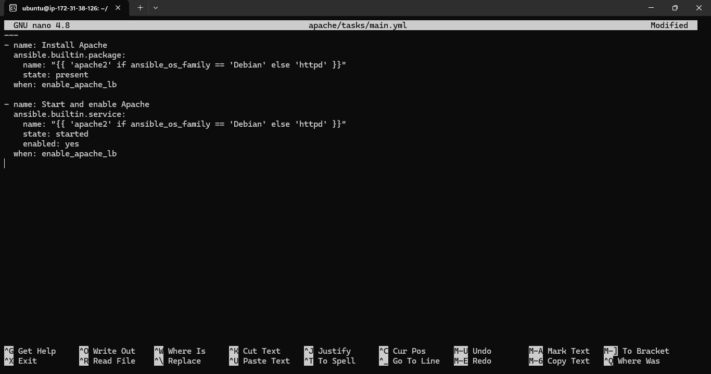

**🧩 Step 4: Create Static Assignment File**

We’ll now create a static assignment playbook to include both roles — but ensure only one executes depending on variables.

`static-assignments/loadbalancers.yml`
```yml
---
- hosts: lb
  roles:
    - { role: nginx, when: enable_nginx_lb and load_balancer_is_required }
    - { role: apache, when: enable_apache_lb and load_balancer_is_required }
```
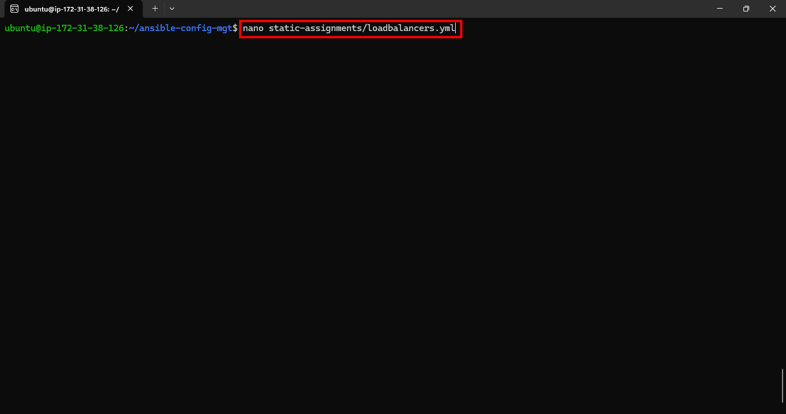
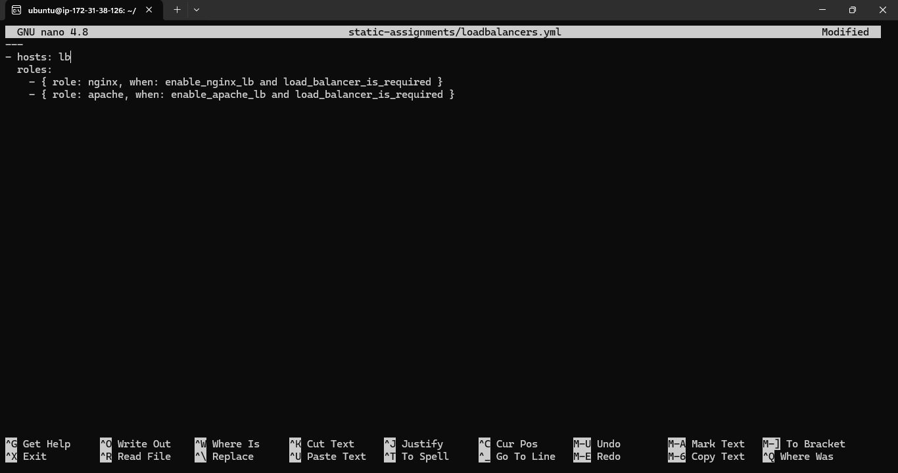

> 🧠 Only the role with true flags will execute.

**📦 Step 5: Integrate with site.yml**

We now import our load balancer playbook into the main `site.yml`.
This makes the setup environment-driven — automatically reading from the dynamic variables loaded earlier.

`playbooks/site.yml`
```yml
---
# Load dynamic environment variables
- name: Include dynamic environment variables
  hosts: all
  tasks:
    - include_vars: ../dynamic-assignments/env-vars.yml
      tags:
        - always

# Import common configuration
- import_playbook: ../static-assignments/common.yml

# Import UAT webserver configurations
- import_playbook: ../static-assignments/uat-webservers.yml

# Import load balancer assignment (conditionally)
- import_playbook: ../static-assignments/loadbalancers.yml
  when: load_balancer_is_required | default(false)
```
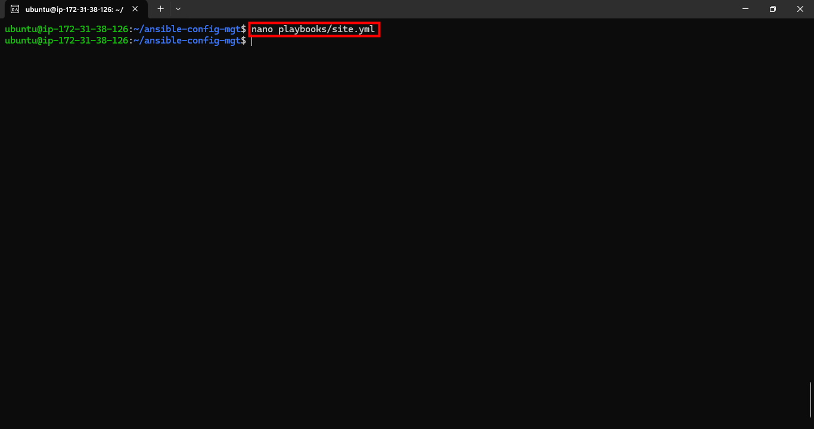
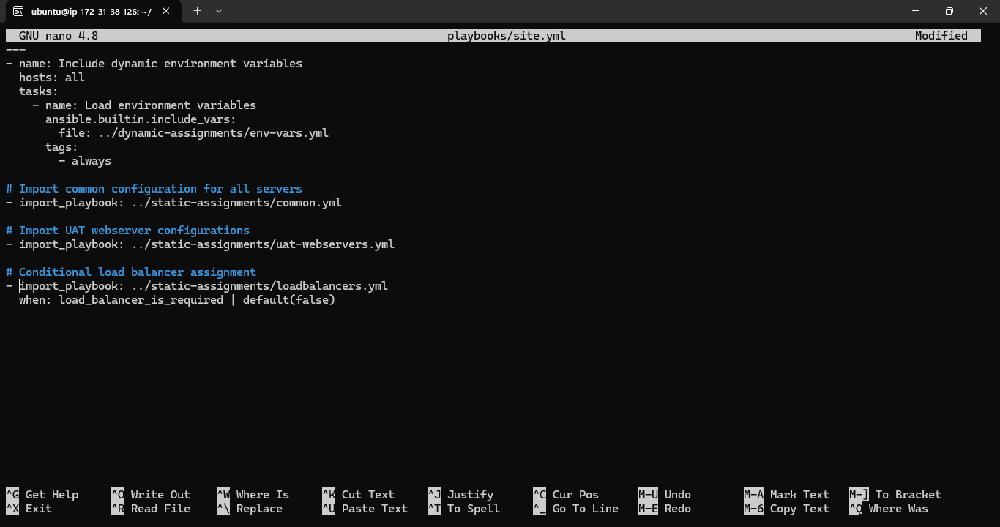

**🌍 Step 6: Configure Environment Variables**

You control which load balancer to deploy via the environment variables file (for example, `env-vars/uat.yml`).

`env-vars/uat.yml`
```yml
enable_nginx_lb: false
enable_apache_lb: true
load_balancer_is_required: true
```
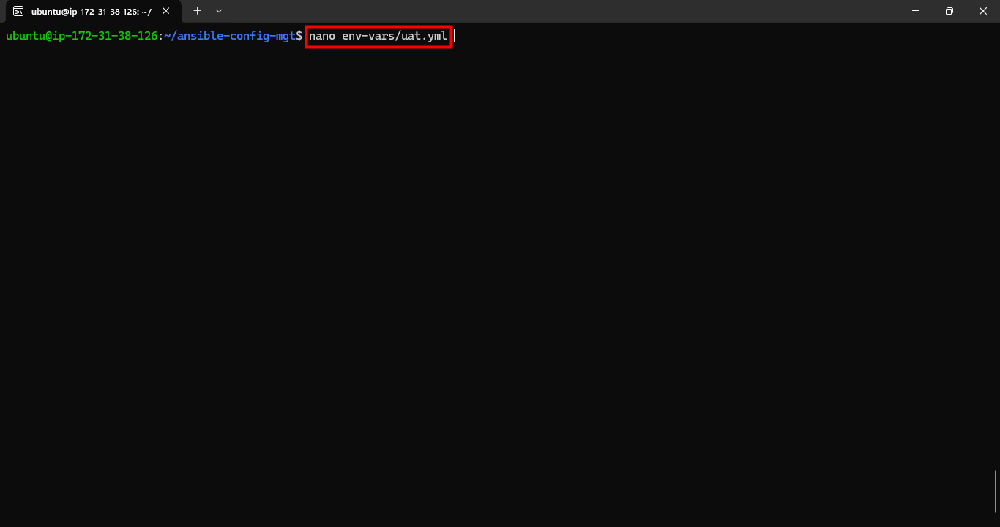

To switch to nginx:
```yml
---
enable_nginx_lb: true
enable_apache_lb: false
load_balancer_is_required: true
```
> ✅ Environment-driven configuration ensures flexibility across DEV, UAT, and PROD.

### 🚀 Run & Test

**1️⃣ Run playbook**
```bash
ansible-playbook -i inventory/uat.ini playbooks/site.yml
```
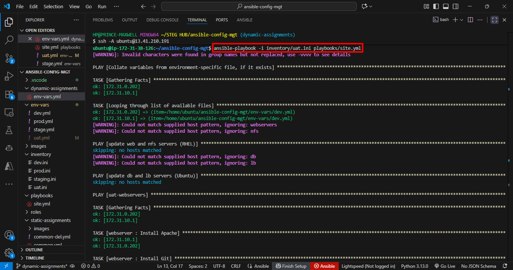

**2️⃣ Verify installation**

SSH into your target servers and verify installations.
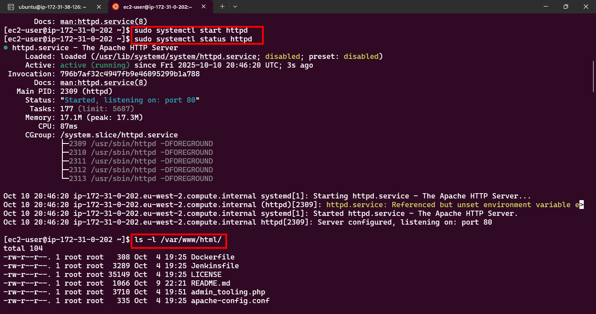
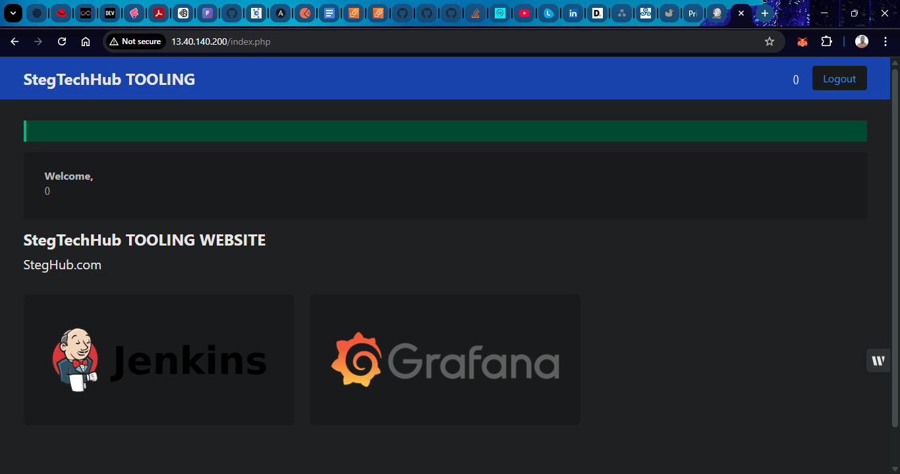

## 🧱 Troubleshooting Tips
| Issue                         | Possible Cause                        | Solution                                         |
| ----------------------------- | ------------------------------------- | ------------------------------------------------ |
| “Must be a dictionary” error  | Using `include_vars` incorrectly      | Ensure the file loaded is YAML (key-value pairs) |
| Nothing happens during run    | Variables not set to `true`           | Check your `env-vars` file                       |
| Both NGINX & Apache installed | Both `enable_*` set `true`            | Only one should be `true`                        |
| Service fails to start        | OS mismatch                           | Adjust package/service name logic                |
| Role skipped unexpectedly     | `load_balancer_is_required` = `false` | Set to `true` in your env-vars                   |

## 🏁 Commit & Push to GitHub
Once tested and verified:
```bash
git add .
git commit -m "Implemented dynamic load balancer roles for nginx and apache"
git push origin roles-feature
```
You can then create a Pull Request and merge it into the main branch.

## ✅ Summary

This implementation:

- Dynamically loads environment-specific variables
- Conditionally deploys NGINX or Apache
- Keeps roles modular, reusable, and scalable
- Makes your infrastructure truly environment-aware
